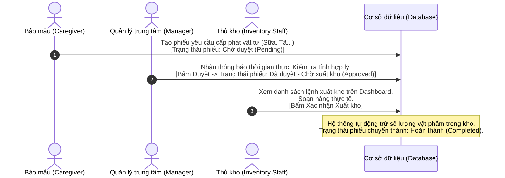
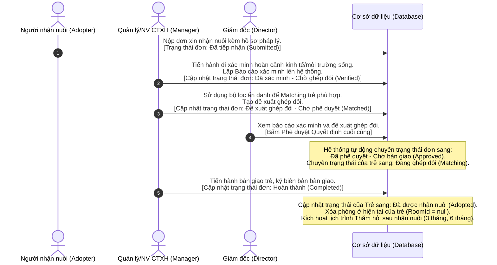

# TÀI LIỆU ĐẶC TẢ TÁI CẤU TRÚC HỆ THỐNG QUẢN LÝ TRUNG TÂM BẢO TRỢ XÃ HỘI (HOPECENTER)

Tài liệu này được biên soạn để thực hiện việc tái cấu trúc luồng nghiệp vụ, danh sách Usecase, phân quyền và thiết kế giao diện cho hệ thống **HopeCenter** dựa trên khảo sát từ báo cáo học phần (`225DAPM_Nhom39.docx`) và các yêu cầu ràng buộc cốt lõi từ `UpdateProject.md`.

---

## 1. CHUẨN HÓA DANH SÁCH ACTOR VÀ MA TRẬN PHÂN QUYỀN (USECASE)

Để sát với thực tế vận hành và đảm bảo an toàn thông tin, quyền lợi trẻ em, hệ thống được cấu trúc lại với **9 nhóm Actor** chính. 
> [!IMPORTANT]
> **Ràng buộc an toàn & bảo mật:**
> 1. **Quyền trẻ em:** Khách vãng lai (Guest) tuyệt đối không được xem danh sách trẻ. Người nhận nuôi chỉ được xem danh sách trẻ phù hợp sau khi đã được xác minh hồ sơ và các thông tin định danh nhạy cảm (tên thật, địa chỉ) đã bị ẩn/mã hóa.
> 2. **Chức năng "Theo dõi sau nhận nuôi":** Chuyển giao hoàn toàn từ **Bảo mẫu** sang **Quản lý / Nhân viên Công tác xã hội**.
> 3. **Quyền hạn Admin:** Admin chỉ quản lý kỹ thuật (tài khoản, phân quyền, cấu hình, logs), tuyệt đối không có quyền xem hoặc sửa hồ sơ trẻ em và người nhận nuôi.

### BẢNG MA TRẬN PHÂN QUYỀN (ACTOR VS USECASE)
Ký hiệu: `X` (Có quyền truy cập/thực hiện).

| STT | Nhóm Usecase & Chức năng | Giám đốc (Director) | Quản lý / NV CTXH | Kế toán / Thủ kho | NV Y tế | Bảo mẫu (Caregiver) | Admin | Người nhận nuôi | Nhà tài trợ | Khách vãng lai |
| :--- | :--- | :---: | :---: | :---: | :---: | :---: | :---: | :---: | :---: | :---: |
| **1** | Xác thực (Đăng nhập, Đăng xuất, Đăng ký) | X | X | X | X | X | X | X | X | |
| **2** | Xem giới thiệu, tin tức & số liệu tổng quan (public) | X | X | X | X | X | X | X | X | X |
| **3** | Xem danh sách trẻ em (Đầy đủ thông tin định danh) | X | X | | X | X | | | | |
| **4** | Xem danh sách trẻ phù hợp (Đã ẩn thông tin nhạy cảm) | | | | | | | X | | |
| **5** | Đăng ký tài trợ (Online) & Gửi thông tin hỗ trợ | | | | | | | | X | X |
| **6** | Ghi nhận nguồn tài trợ (tiền mặt/hiện vật) | | | X | | | | | | |
| **7** | Quản lý danh mục kho (thực phẩm, bỉm, tã, sữa...) | | | X | | | | | | |
| **8** | Tạo phiếu yêu cầu cấp phát vật tư | | | | | X | | | | |
| **9** | Xét duyệt phiếu yêu cầu cấp phát vật tư | | X | | | | | | | |
| **10** | Xác nhận thực xuất kho vật tư | | | X | | | | | | |
| **11** | Quản lý hồ sơ trẻ em (Tiếp nhận, thông tin cơ bản) | | X | | | | | | | |
| **12** | Đăng ký nhận con nuôi & Nộp hồ sơ pháp lý | | | | | | | X | | |
| **13** | Xem trạng thái hồ sơ nhận con nuôi cá nhân | | | | | | | X | | |
| **14** | Thẩm định & xác minh hồ sơ nhận con nuôi | | X | | | | | | | |
| **15** | Đề xuất ghép đôi (Matching) Trẻ - Gia đình | | X | | | | | | | |
| **16** | Phê duyệt quyết định nhận nuôi chính thức | X | | | | | | | | |
| **17** | Bàn giao trẻ & Lưu trữ biên bản bàn giao pháp lý | | X | | | X | | | | |
| **18** | Theo dõi định kỳ & ghi nhận báo cáo sau nhận nuôi | | X | | | | | | | |
| **19** | Quản lý bệnh án, khám sức khỏe & tủ thuốc y tế | | | | X | | | | | |
| **20** | Điểm danh trẻ theo phòng & xem lịch trực | | | | | X | | | | |
| **21** | Checklist sinh hoạt hàng ngày của trẻ | | | | | X | | | | |
| **22** | Báo cáo sự cố khẩn cấp (sốt cao, tai nạn...) | | | | | X | | | | |
| **23** | Phân công công việc (Task Assignment) | | X | | | | | | | |
| **24** | Xem và cập nhật tiến độ công việc được giao | X | X | X | X | X | | | | |
| **25** | Phê duyệt kế hoạch chăm sóc/kế hoạch tháng | X | | | | | | | | |
| **26** | Xem báo cáo chiến lược & biểu đồ tài chính trung tâm | X | | | | | | | | |
| **27** | Quản trị tài khoản, phân quyền, cấu hình & xem logs | | | | | | X | | | |

---

## 2. THIẾT KẾ CHI TIẾT GIAO DIỆN DASHBOARD CHUYÊN BIỆT

Mỗi Actor sau khi đăng nhập thành công sẽ được hệ thống điều hướng trực tiếp đến Dashboard chuyên biệt của mình. Layout được tối ưu hóa cho từng nhiệm vụ.

### 2.1. Giao diện Giám đốc (Director Dashboard)
* **Trọng tâm UI:** Báo cáo chiến lược, giám sát vĩ mô và phê duyệt tối cao. Giao diện trực quan với nhiều biểu đồ.
* **Các thành phần dữ liệu (Widgets):**
  * *Biểu đồ cột (Bar Chart):* Doanh thu tài trợ (Donations) vs Chi phí vận hành trung tâm theo tháng.
  * *Số liệu tổng quan (KPI Cards):* Tổng số trẻ (phân chia theo độ tuổi, giới tính, tình trạng sức khỏe), Tổng nhân sự, Số ca nhận nuôi thành công trong năm.
  * *Danh sách chờ duyệt:* Các hồ sơ pháp lý nhận con nuôi đã được xác minh và ghép đôi thành công, các kế hoạch chăm sóc trẻ dài hạn, các lệnh xuất kho giá trị lớn.
* **Các nút hành động (Action Buttons) trên UI:**
  * `[Xem chi tiết]` hồ sơ ghép đôi -> `[Phê duyệt đơn nhận nuôi]` / `[Từ chối]` (yêu cầu nhập lý do).
  * `[Phê duyệt kế hoạch tháng]` / `[Yêu cầu chỉnh sửa]`.
  * `[Phê duyệt phiếu xuất kho]` (cho các yêu cầu vật tư vượt định mức thông thường).
  * `[Xuất báo cáo PDF]` (Báo cáo tài chính, báo cáo nhân sự).

### 2.2. Giao diện Quản lý / NV Công tác xã hội (Manager Workspace)
* **Trọng tâm UI:** Quản lý hành chính trẻ em, nhân sự trực tiếp, ghép đôi nhận nuôi và phân công công việc.
* **Các thành phần dữ liệu (Widgets):**
  * *Danh sách quản lý trẻ:* Danh sách trẻ hiện tại, trẻ mới tiếp nhận, bộ lọc theo phòng ban, độ tuổi.
  * *Quản lý hồ sơ nhận nuôi:* Danh sách đơn xin nhận nuôi mới (`Pending`), đơn đã xác minh (`Verified`), đơn cần thăm hỏi sau nhận nuôi (`Follow-up Due`).
  * *Bảng điều phối công việc:* Giao diện kéo thả (Kanban) phân công công việc hàng ngày cho Bảo mẫu và nhân viên khác.
* **Các nút hành động (Action Buttons) trên UI:**
  * `[Tiếp nhận trẻ mới]`: Mở form nhập thông tin Child (Tên, ngày sinh, hoàn cảnh, phòng gán).
  * `[Xác minh hồ sơ người nhận nuôi]`: Cập nhật kết quả khảo sát kinh tế, điều kiện sống gia đình.
  * `[Ghép đôi (Matching)]`: Mở thuật toán gợi ý trẻ phù hợp dựa trên mong muốn và điều kiện của gia đình nhận nuôi (Ẩn thông tin định danh của trẻ).
  * `[Báo cáo thăm hỏi]`: Ghi nhận nhật ký kiểm tra định kỳ sau nhận nuôi (Tình trạng sức khỏe, môi trường sống của trẻ).
  * `[Giao việc]`: Phân công nhiệm vụ mới cho bảo mẫu.
  * `[Duyệt phiếu yêu cầu vật tư]`: Phê duyệt các phiếu yêu cầu bỉm, sữa, thực phẩm hàng ngày từ bảo mẫu gửi lên.

### 2.3. Giao diện Nhân viên Y tế (Medical Staff Dashboard)
* **Trọng tâm UI:** Quản lý sức khỏe, lịch khám bệnh, tiêm chủng và kho dược phẩm của trung tâm.
* **Các thành phần dữ liệu (Widgets):**
  * *Danh sách theo dõi sức khỏe:* Trẻ đang nằm phòng cách ly y tế, trẻ có bệnh nền cần theo dõi đặc biệt.
  * *Lịch trình y tế:* Lịch tiêm chủng tuần tới, lịch khám sức khỏe định kỳ của toàn trung tâm.
  * *Kho thuốc:* Cảnh báo các loại thuốc sắp hết hạn hoặc dưới mức tồn kho tối thiểu (`MinStockLevel`).
* **Các nút hành động (Action Buttons) trên UI:**
  * `[Thêm hồ sơ khám bệnh]`: Nhập kết quả chuẩn đoán, chiều cao, cân nặng, đơn thuốc điều trị.
  * `[Cập nhật tủ thuốc]`: Khai báo nhập thêm thuốc y tế hoặc cập nhật số lượng thực tế.
  * `[Ghi nhận tiêm chủng]`: Xác nhận trẻ đã hoàn thành mũi tiêm chủng theo lịch.
  * `[Chuyển phòng y tế]`: Chuyển trạng thái trẻ sang điều trị tại phòng y tế và cập nhật phòng ở tạm thời.

### 2.4. Giao diện Bảo mẫu / NV Chăm sóc (Caregiver Dashboard)
* **Trọng tâm UI:** Thiết kế tối giản, cỡ chữ lớn, tối ưu hóa hiển thị và thao tác trên Thiết bị di động (Mobile/Tablet) để dễ dàng sử dụng khi đang làm việc thực địa.
* **Các thành phần dữ liệu (Widgets):**
  * *Ca trực của tôi:* Thông tin phòng được phân công chăm sóc, danh sách trẻ trong phòng.
  * *Checklist hoạt động ngày:* Nhiệm vụ sinh hoạt cần hoàn thành (Bữa sáng, Vệ sinh phòng, Cho uống sữa, Bữa trưa, Giờ ngủ trưa, Hoạt động vui chơi).
  * *Nhiệm vụ được giao:* Các công việc phát sinh do Quản lý phân công.
* **Các nút hành động (Action Buttons) trên UI:**
  * `[Điểm danh]`: Bấm chọn nhanh trạng thái của từng trẻ trong phòng (`Có mặt`, `Vắng mặt - Phòng Y Tế`, `Vắng mặt - Đi học`).
  * `[Báo cáo sự cố khẩn cấp]`: Nút đỏ nổi bật ở góc màn hình. Bấm vào để báo cáo nhanh (Ví dụ: bé A bị sốt cao, chấn thương khi chơi). Tự động gửi thông báo khẩn cấp đến Quản lý và Y tế.
  * `[Tạo phiếu yêu cầu vật tư]`: Chọn phòng -> Chọn loại vật tư (Sữa bột, tã giấy, bỉm) -> Nhập số lượng yêu cầu -> Gửi đi. (Không có quyền tự sửa số lượng trong kho).

### 2.5. Giao diện Kế toán / Thủ kho (Accountant & Inventory Dashboard)
* **Trọng tâm UI:** Minh bạch dòng tiền tài trợ và kiểm soát xuất nhập kho vật tư thực tế.
* **Các thành phần dữ liệu (Widgets):**
  * *Báo cáo quỹ tài trợ:* Lịch sử đóng góp mới nhất, tổng số tiền mặt quỹ hiện tại.
  * *Yêu cầu xuất kho chờ xử lý:* Danh sách các phiếu yêu cầu vật tư từ Bảo mẫu đã được Quản lý duyệt thành công (`Đã duyệt - Chờ xuất kho`).
  * *Bảng cảnh báo tồn kho:* Danh sách mặt hàng chạm ngưỡng tối thiểu cần nhập kho thêm.
* **Các nút hành động (Action Buttons) trên UI:**
  * `[Ghi nhận tài trợ mới]`: Nhập thông tin nhà tài trợ, hình thức tài trợ (Tiền mặt/Hiện vật), giá trị và mục đích tài trợ (nếu có).
  * `[Nhập kho vật tư]`: Nhập thêm số lượng thực phẩm, đồ sinh hoạt vào kho.
  * `[Xác nhận xuất kho]`: Nhấp vào phiếu yêu cầu -> Soạn hàng thực tế -> Bấm xác nhận xuất để hệ thống tự động trừ số lượng tồn kho và chuyển trạng thái phiếu sang `Hoàn thành`.

### 2.6. Giao diện Quản trị viên (Admin Dashboard)
* **Trọng tâm UI:** Thiết lập bảo mật, quản lý tài khoản và giám sát vận hành hệ thống.
* **Các thành phần dữ liệu (Widgets):**
  * *Thống kê hệ thống:* Tổng số tài khoản, số lượng tài khoản đang hoạt động (`Active`), thống kê truy cập.
  * *Bảng nhật ký hoạt động (System Audit Logs):* Lịch sử thao tác nhạy cảm (Đăng nhập thất bại, đổi mật khẩu, xuất dữ liệu, thay đổi quyền hạn).
* **Các nút hành động (Action Buttons) trên UI:**
  * `[Tạo tài khoản mới]`: Nhập email, họ tên và phân vai trò cụ thể.
  * `[Khóa tài khoản]` / `[Mở khóa tài khoản]`.
  * `[Phân quyền chi tiết]`: Cấu hình quyền hạn cho từng nhóm vai trò (Role).
  * *Lưu ý:* Màn hình tuyệt đối không có menu dẫn đến hồ sơ chi tiết của trẻ em hoặc thông tin tài chính chi tiết của người nhận nuôi để đảm bảo an toàn thông tin tối mật.

---

## 3. THIẾT KẾ KỊCH BẢN CHO 2 QUY TRÌNH LIÊN PHÒNG BAN (CROSS-FUNCTIONAL WORKFLOW)

### 3.1. Quy trình 1: Quản lý Kho vật tư (Inventory Management)

Luồng nghiệp vụ xử lý dữ liệu và chuyển đổi trạng thái (Status) của hệ thống:

* **Chi tiết cấu trúc dữ liệu Phiếu yêu cầu (`InventoryRequisition`):**
  * `Id` (Guid, PK)
  * `RequesterId` (EmployeeId, FK - Người yêu cầu)
  * `RoomId` (RoomId, FK - Phòng nhận vật tư)
  * `RequestDate` (DateTime - Ngày yêu cầu)
  * `Status` (Enum: `Pending`, `Approved`, `Completed`, `Rejected`)
  * `ApproverId` (EmployeeId, FK, Nullable - Người duyệt)
  * `ApprovedDate` (DateTime, Nullable - Ngày duyệt)
  * `Details` (Danh sách vật tư):
    * `ItemId` (InventoryItemId, FK)
    * `QuantityRequested` (int - Số lượng yêu cầu)
    * `QuantityDisbursed` (int - Số lượng thực xuất)

---

### 3.2. Quy trình 2: Xét duyệt hồ sơ nhận nuôi (Adoption Workflow)

Quy trình phối hợp liên phòng ban từ lúc tiếp nhận đơn đến khi bàn giao và theo dõi sau nhận nuôi:

* **Chi tiết cấu trúc dữ liệu Đơn nhận nuôi (`AdoptionApplication`):**
  * `Id` (Guid, PK)
  * `AdopterId` (AdopterId, FK)
  * `ChildId` (ChildId, FK)
  * `SubmitDate` (DateTime - Ngày nộp)
  * `Status` (Enum: `Submitted`, `Verified`, `Matched`, `Approved`, `Completed`, `Rejected`)
  * `Reason` (string - Lý do nhận nuôi)
  * `VerificationNotes` (string - Báo cáo xác minh thực tế)
  * `MatchingScore` (double - Điểm tương thích)
  * `ApprovedDate` (DateTime, Nullable - Ngày duyệt)
  * `HandoverDate` (DateTime, Nullable - Ngày bàn giao thực tế)

* **Chi tiết cấu trúc dữ liệu Lịch sử trạng thái Trẻ em (`ChildStatusHistory`):**
  * `Id` (Guid, PK)
  * `ChildId` (ChildId, FK)
  * `ChangedById` (AccountId, FK)
  * `OldStatus` (ChildStatus - Trạng thái cũ)
  * `NewStatus` (ChildStatus - Trạng thái mới)
  * `ChangeDate` (DateTime)
  * `Reason` (string - Lý do thay đổi)

---

## 4. HƯỚNG DẪN DÀNH CHO ĐỘI NGŨ LẬP TRÌNH & THIẾT KẾ DATABASE

Để chuyển hóa tài liệu đặc tả này thành mã nguồn thực tế, đội ngũ lập trình cần chú ý:
1. **Thiết kế phân quyền ở Backend (ASP.NET Core Web API):** 
   Sử dụng Policy-based Authorization dựa trên Claim `Role` của người dùng. Viết các Middleware lọc dữ liệu trẻ em theo vai trò của người yêu cầu:
   * Nếu Role là `Adopter`, API lấy danh sách trẻ bắt buộc phải chạy qua hàm ẩn danh dữ liệu (mã hóa tên, ẩn thông tin địa lý).
   * Nếu Role là `Admin`, API trả về danh sách trẻ sẽ trả về mã lỗi `403 Forbidden`.
2. **Cập nhật Database (Entity Framework Core):**
   * Bổ sung trường `Status` (Enum) vào thực thể `AdoptionApplication`.
   * Cấu hình quan hệ giữa `InventoryRequisition` và `Room` (Mỗi phòng nhận vật tư) cũng như `InventoryRequisitionDetail` (Danh mục chi tiết vật tư yêu cầu).
   * Viết Migration để cập nhật cấu trúc database phù hợp với cấu trúc dữ liệu của các thực thể y tế (`MedicalRecord`), lịch trình theo dõi hậu nhận nuôi (`PostAdoptionFollowUp`).
3. **Phát triển Frontend (Next.js / React):**
   * Xây dựng layout dashboard động. Khi User đăng nhập thành công, đọc `Role` từ Token JWT và điều hướng đến Route tương ứng (ví dụ: `/director/dashboard`, `/caregiver/dashboard`).
   * Sử dụng thư viện Tailwind CSS v4 để tối ưu hóa thiết kế Mobile-first cho giao diện Bảo mẫu (Caregiver).
